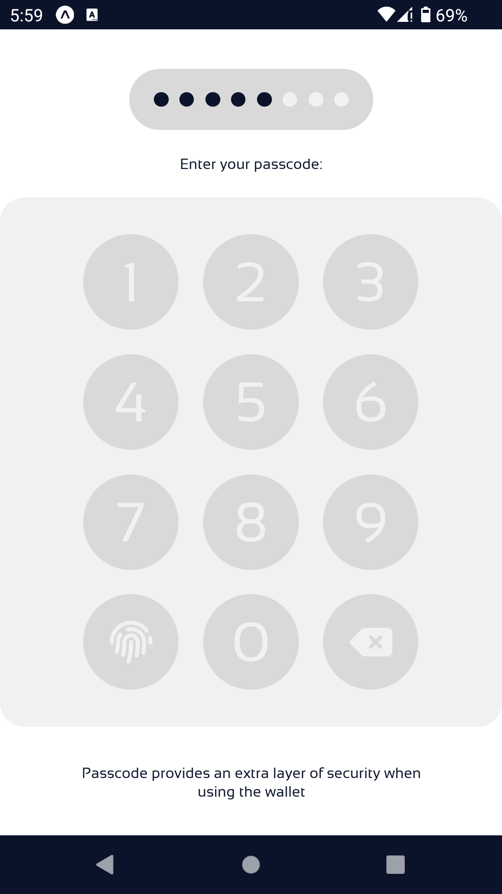

# Crypto‑wallet: Featuring an efficient way to generate master‑seed

<p>
  <!-- iOS -->
  
  <!-- Android -->
  
</p>

## Introduction

A cross-platform cryptocurrency wallet for mobile devices featuring an alternative approach to <a href="https://github.com/bitcoin/bips/blob/master/bip-0039.mediawiki">BIP39 mnemonics</a> in creating the master-seed used in <a href="https://github.com/bitcoin/bips/blob/master/bip-0032/derivation.png">BIP 32 HD-wallets</a>, that improves user experience and security. This approach is based on an image as a randomization factor, and a multi-pattern as the security element.

## Implementation

The initial implementation is under development for Android and IOS devices, using React‑native.
### Demo

#### This is the initial design of the app pages:

- The splash Page:

  
---------------------------------------------------
- The authentication page:

  
---------------------------------------------------
- The main menu loads in case there is no master seed defined in the storage:

  
---------------------------------------------------
- This page helps you to create a new wallet or import your already existing master seed:

  
---------------------------------------------------
- This is the main panel of the app. Here you can see your assets and their values; you can also transfer your assets in this page or share your public-keys with the payers:

  
---------------------------------------------------

### How to run in development environment?

- Install packages:

```shell
npm install
```

- Run:

```shell
npm start
```
